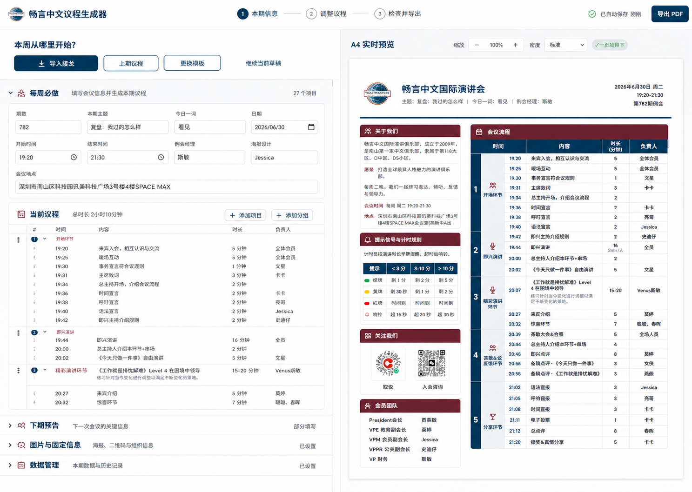

# 畅言中文议程生成器：紧凑专业控制台设计

日期：2026-08-07

实施目标：`agenda_generator_modern.html`

参考页面：https://scorpioapn.github.io/agenda_generator_modern.html

## 目标与边界

把现有新版从“功能卡片集合”收敛成一套按每周任务组织的议程工作台。例会经理应当能快速完成四件事：从接龙或模板开始、补齐本期信息、微调议程、检查并导出 A4。

本轮只改工作台的信息架构、视觉层级、响应式布局和必要的交互提示。保留现有数据模型、自动排期、本地保存、云同步、接龙导入、模板切换、图片与固定信息维护、A4 预览、PDF/打印/文本/JSON 等既有能力，不新增路由、账号体系或业务功能，也不改 A4 成品的内容结构。

## 选定方向

采用“紧凑专业控制台”。它延续现有左右分栏和 A4 预览，降低老用户迁移成本；同时用顶部三步流程和按频率分组的编辑区，替代当前平级卡片与重复操作。

未采用“任务导向侧边轨”的原因是永久步骤轨会挤压已有 470px 编辑区；未采用“预览主导检查器”的原因是它需要更大幅度重写议程编辑方式。两者的优点会有限吸收：保留清楚的三步进度、让 A4 始终是视觉主角、把行级操作改为悬停或聚焦时出现。

## 信息架构

### 顶部栏

桌面端顶部栏横跨整个应用，包含：

- 产品标识与标题。
- 三步流程：`本期信息`、`调整议程`、`检查并导出`。点击后滚动到对应区域；当前步骤按编辑区滚动位置更新。
- 保存状态。继续复用现有“已自动保存”、同步中、冲突和失败状态。
- 单一主导出按钮 `导出 PDF`。`打印 A4`、文本、JSON 和同步管理放入“更多”菜单或现有导出面板，不在多个位置重复出现。

顶部栏高度控制在 60–64px，使用细底边和轻微粘性阴影；不再使用多个大圆角白色导航按钮。

### 编辑区

桌面端编辑区保持约 470–560px 的可调宽度，内部按任务频率组织：

1. `本周从哪里开始？`：`导入接龙` 为唯一深蓝主按钮；`更换模板` 为描边按钮；`继续编辑当前草稿` 是定位到当前议程的文字操作。产品目前没有历史期次存档，因此不新增“沿用上期”能力。
2. `每周必做`：默认展开，包含会议信息和当前议程。
3. `下期预告`：保持可见但低于主任务，默认半展开或按已有内容状态展开。
4. `图片与固定信息`：默认折叠。
5. `数据管理`：默认折叠，容纳 JSON 备份、多设备同步与其他低频工具。

会议信息使用紧凑字段网格，不再单独套一张高阴影卡片。议程使用一组连续表格/列表，章节标题、时间、内容、时长、负责人形成稳定列。复制、删除和拖动操作在 hover、focus-within 或触控菜单中出现，避免每行永久堆叠按钮。

### 预览区

A4 预览仍是桌面端右侧的权威成品。顶部只保留缩放、密度和“一页放得下”状态；导出主操作归入全局顶部栏，避免重复。

预览背景使用中性冷灰，A4 页面保持白色、轻边框和克制阴影。深蓝与酒红主要服务 A4 成品，编辑器使用暖白、深蓝与中性灰，减少编辑器与成品争抢视觉注意力。

## 响应式行为

### 桌面（> 920px）

- 顶部栏固定，下面是编辑区与预览区双列。
- 两列各自滚动，顶部流程能定位编辑区目标，并保持预览不跳动。
- 议程表格显示完整的时间、内容、时长和负责人列。

### 平板与窄桌面（621–920px）

- 保留顶部三步，但标签缩短为 `信息`、`议程`、`导出`。
- 主体改为单列任务面板，通过现有面板切换逻辑显示编辑或预览。
- 关键操作保持 44px 以上触控高度。

### 手机（≤ 620px）

- 保留现有底部三项任务栏：`信息`、`议程`、`预览`，导出继续位于预览面板，不新增第四项。
- 顶部仅保留品牌、保存状态和设置/更多入口；避免四个同权图标占满首屏。
- 会议信息单列；议程行使用“时间 + 标题”为主层级，时长和负责人为次层级；点击整行进入现有底部编辑抽屉。
- 预览提供清楚的放大/全屏入口，并保留安全区间距。
- 底部任务栏、编辑抽屉和 Toast 不互相遮挡。

## 视觉系统

- 颜色继续使用 `--tm-blue`、`--tm-blue-deep`、`--tm-maroon`，但酒红只用于 A4 成品、错误或极少量品牌强调。
- 背景从当前偏重的暖色编辑器底色收敛为暖白/浅灰；普通分区使用 1px 分隔线，不使用大面积阴影。
- 圆角统一为 6px、10px、14px 三档；按钮以 8–10px 为主，面板不超过 14px。
- 中文界面只使用现有无衬线字体栈；时间数字继续使用 Oswald。正文 14px，辅助信息 12–13px，区块标题 16–18px，页面标题 22–24px。
- 按钮只保留三层：深蓝实心主按钮、描边次按钮、无底色文字按钮。
- 动效控制在 120–180ms；在 `prefers-reduced-motion: reduce` 下取消位移、缩放和非必要过渡。

## 组件与实现边界

现有单文件继续作为入口，不拆分数据逻辑。新增或重组的界面单元应具有独立职责：

- `workflow-header`：品牌、步骤、保存状态和导出入口。
- `start-actions`：导入接龙、更换模板、继续编辑当前草稿。
- `task-section`：统一承载可折叠的频率分区，使用原生 button 与 `aria-expanded`。
- `meeting-summary` / `meeting-fields`：紧凑摘要与字段网格。
- `agenda-table`：保留现有拖动、点击编辑、复制和删除事件接口，只调整 DOM 包装和样式状态。
- `preview-toolbar`：缩放、密度、一页状态，不拥有重复导出按钮。
- `mobile-taskbar`：继续复用现有 `data-mobile-nav` 与面板状态。

状态仍由现有 `state`、`renderAll()`、`saveData()` 与云同步控制器驱动。新折叠状态和当前流程步骤只属于视图状态，不写入议程 JSON，不影响导入导出兼容性。

## 错误与状态反馈

- 自动保存、同步中、同步冲突和保存失败沿用现有状态源，在顶部栏以文字加图标呈现，颜色不是唯一信号。
- 导入接龙和模板切换继续使用现有确认、预览、撤销与 Toast 流程。
- A4 溢出继续显示明确警告；`一页放得下` 状态与密度控件相邻。
- 折叠低频分区时，如果其中存在错误、同步冲突或未完成必填项，分区标题显示状态摘要并自动保持可发现。
- 所有模态框和移动编辑抽屉必须限制焦点，Esc 关闭后把焦点还给触发控件。

## 可访问性

- 顶部步骤使用按钮或锚点，并提供可见 focus 样式和 `aria-current="step"`。
- 折叠分区使用真实 button、`aria-expanded` 和 `aria-controls`。
- 行级编辑触发器保留可读名称；仅 hover 出现的动作也必须能通过键盘 focus 显示。
- 隐藏文件输入不作为无名称 Tab 停靠点。
- 补充 `prefers-reduced-motion` 分支；保持现有颜色对比水平。
- 移动编辑抽屉修复焦点逃逸和关闭后的焦点回落。

## 验收与测试

### 静态与行为测试

- 扩充现有 Node 测试，覆盖顶部三步、开始区动作顺序、低频分区默认折叠、单一主导出入口、移动任务栏仍为三项、reduced-motion 规则和 ARIA 属性。
- 保持现有数据、接龙导入、模板、云同步、PDF、时间计算和移动布局测试全部通过。
- 新增视图状态测试，确认折叠与步骤导航不改写议程数据。

### 浏览器验证

- 1440×1024：双列、顶部粘性流程、编辑区和预览区独立滚动、无横向溢出。
- 720×500 等效 200%：单列重排、控件不被裁切。
- 393×852 与 412×915：三项底部任务栏、触控尺寸、编辑抽屉、Toast、安全区和预览放大入口。
- 键盘：从顶部流程到表单、议程行、折叠分区和导出菜单顺序合理；模态框与抽屉焦点不逃逸。
- 视觉对比：把线上参考截图、选定视觉稿和本地实现截图放入同一比较输入，至少完成一次桌面和一次移动端修正循环。

## 完成标准

用户打开页面后能在首屏理解“从接龙或模板开始”，能通过三步流程完成本周议程，编辑区不再由同权卡片和重复按钮主导；A4 仍然是视觉主角；桌面和移动端核心操作可用、可访问，现有业务与导出测试不回退。
